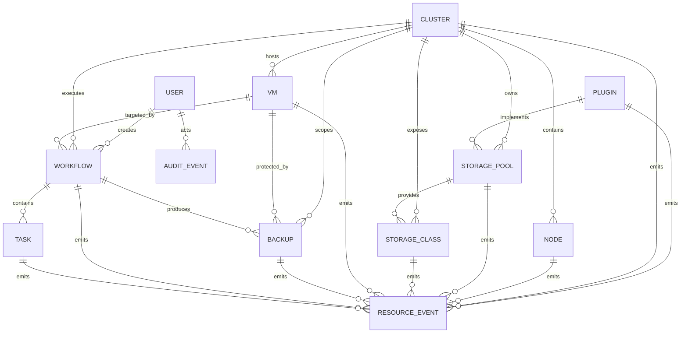

# P2-02 ER Model Design v0.9

> Status: Design Review
> Version: v0.9
> Depends on:
> - FROZEN-P1-01-DOMAIN-MODEL-v1.0
> - FROZEN-P2-01-DATA-ARCHITECTURE-v1.0
> Scope: CPP logical entity relationship model

---

## 1. Purpose

This document defines the logical ER model for CPP V2.0.

It translates the frozen resource model into entity relationships, cardinality, ownership, lifecycle references and deletion rules.

It does not define final SQL DDL. Physical tables, indexes, constraints and migrations are defined in P2-03 and P2-04.

---

## 2. Core Entities

CPP V2.0 contains the following primary entities:

```text
Cluster
Node
StoragePool
StorageClass
VM
Backup
Workflow
Task
Plugin
User
AuditEvent
ResourceEvent
```

All resource entities inherit the common Resource contract:

```text
metadata
spec
status
generation
resource_version
created_at
updated_at
deleted_at
```

---

## 3. High-Level ER Diagram



---

## 4. Cluster Relationships

Cluster is the top-level infrastructure aggregate.

```text
Cluster 1 -> N Node
Cluster 1 -> N StoragePool
Cluster 1 -> N StorageClass
Cluster 1 -> N VM
Cluster 1 -> N Backup
Cluster 1 -> N Workflow
Cluster 1 -> N ResourceEvent
```

Rules:

```text
1. Node must belong to exactly one Cluster.
2. StoragePool must belong to exactly one Cluster.
3. StorageClass must belong to exactly one Cluster.
4. VM must belong to exactly one Cluster.
5. Backup must belong to exactly one Cluster.
6. Workflow may belong to one Cluster or be platform-scoped.
7. Cluster deletion is blocked while active dependent resources exist.
```

---

## 5. Node Relationships

Node represents compute capacity inside a Cluster.

```text
Node N -> 1 Cluster
Node N <-> N StoragePool optional
Node 1 -> N VM runtime placements optional
```

The Node-to-StoragePool relationship is many-to-many because local and distributed storage can span multiple nodes.

Logical join entity:

```text
NodeStoragePool
```

Fields:

```text
node_id
storage_pool_id
role
status
created_at
```

VM placement is observed state, not a permanent ownership relationship. VM may reference current node through status, but node deletion must not cascade-delete VM.

---

## 6. StoragePool Relationships

StoragePool represents a logical backend.

```text
StoragePool N -> 1 Cluster
StoragePool 1 -> N StorageClass
StoragePool N <-> N Node optional
StoragePool N -> 1 Plugin optional
```

Rules:

```text
1. StorageClass must reference one StoragePool.
2. StoragePool may be plugin-backed.
3. StoragePool deletion is blocked while active StorageClass resources reference it.
4. StoragePool soft deletion preserves historical Backup and Audit references.
```

---

## 7. StorageClass Relationships

StorageClass is an independent aggregate root.

```text
StorageClass N -> 1 Cluster
StorageClass N -> 1 StoragePool
StorageClass 1 -> N VM disk references indirectly
```

Direct VM-to-StorageClass foreign keys are not mandatory because VM disks may be represented inside spec JSON and external PVC/DataVolume resources.

For queryability, an optional normalized relation is allowed:

```text
VMStorageClass
```

Fields:

```text
vm_id
storage_class_id
disk_name
pvc_name
created_at
```

---

## 8. VM Relationships

VM represents a KubeVirt VM.

```text
VM N -> 1 Cluster
VM 1 -> N Backup
VM 1 -> N Workflow
VM N -> 0..1 Node current placement
VM N <-> N StorageClass optional normalized mapping
```

Rules:

```text
1. VM deletion must not automatically delete Backup records.
2. VM current node placement is observed status.
3. VM start/stop/migrate/backup/restore are represented by Workflow.
4. VM namespace and name must be unique within one Cluster.
```

---

## 9. Backup Relationships

Backup is a unified resource.

```text
Backup N -> 1 Cluster
Backup N -> 0..1 VM
Backup N -> 0..1 Workflow
Backup N -> 0..1 User creator through Workflow or direct action
```

Backup target is polymorphic.

Required logical fields:

```text
target_kind
target_id
target_namespace optional
target_name optional
```

Allowed target kinds:

```text
Cluster
Namespace
VM
PVC
Etcd
```

Rules:

```text
1. Backup may outlive its target resource.
2. Target deletion must not cascade-delete Backup.
3. Backup deletion only removes catalog metadata by default; physical artifact purge is a separate Workflow.
```

---

## 10. Workflow Relationships

Workflow is an orchestration aggregate root.

```text
Workflow N -> 0..1 Cluster
Workflow N -> 1 User creator
Workflow 1 -> N Task
Workflow N -> 0..1 target resource
Workflow 1 -> N ResourceEvent
Workflow 1 -> N AuditEvent
```

Workflow target is polymorphic:

```text
target_kind
target_id
```

Rules:

```text
1. Workflow owns Task lifecycle.
2. Task may also exist without Workflow for legacy direct actions.
3. Workflow records must not be cascade-deleted when target resources are deleted.
4. Workflow history is retained according to retention policy.
```

---

## 11. Task Relationships

Task represents one executable unit.

```text
Task N -> 0..1 Workflow
Task N -> 0..1 User requester
Task 1 -> N ResourceEvent
Task 1 -> N AuditEvent
```

Rules:

```text
1. workflow_id may be null for legacy direct execution.
2. Task deletion must not remove execution logs before retention expiry.
3. Task status and return code are immutable after terminal state, except administrative correction events.
```

Terminal states:

```text
succeeded
failed
cancelled
```

---

## 12. Plugin Relationships

Plugin represents an installed capability extension.

```text
Plugin 1 -> N StoragePool optional
Plugin 1 -> N ResourceEvent
Plugin 1 -> N AuditEvent
```

Plugin capability relations are logical rather than hard-coded by dedicated tables in V2.0.

Recommended fields:

```text
category
provider
version
capabilities
```

Plugin deletion is blocked while active resources depend on it.

---

## 13. User Relationships

User represents an authenticated actor.

```text
User 1 -> N Workflow
User 1 -> N Task optional
User 1 -> N AuditEvent
User 1 -> N ResourceEvent optional actor
```

User deletion should normally become disablement or soft deletion. Historical Workflow and Audit references must remain valid.

---

## 14. AuditEvent Entity

AuditEvent is append-only.

Logical fields:

```yaml
AuditEvent:
  id: UUIDv7
  actor_user_id: UUIDv7|null
  actor_type: user | service | system | plugin
  action: string
  target_kind: string|null
  target_id: UUIDv7|null
  workflow_id: UUIDv7|null
  task_id: UUIDv7|null
  result: success | denied | failed
  request_id: string|null
  source_ip: string|null
  details: object
  created_at: datetime
```

Rules:

```text
1. Append-only.
2. No updated_at.
3. No normal soft deletion.
4. Foreign references may be nullable to preserve records after target purge.
```

---

## 15. ResourceEvent Entity

ResourceEvent records lifecycle and state transitions.

Logical fields:

```yaml
ResourceEvent:
  id: UUIDv7
  event_type: string
  resource_kind: string
  resource_id: UUIDv7
  actor_user_id: UUIDv7|null
  workflow_id: UUIDv7|null
  task_id: UUIDv7|null
  generation: integer|null
  resource_version: string|null
  payload: object
  created_at: datetime
```

Rules:

```text
1. Append-only.
2. Event order is defined by created_at plus id.
3. ResourceEvent is not a substitute for current Resource status.
4. Event replay may support future diagnostics but is not required as full event sourcing in V2.0.
```

---

## 16. Polymorphic References

CPP uses polymorphic references for Workflow targets, Backup targets, Audit targets and ResourceEvent targets.

Pattern:

```text
target_kind
target_id
```

Decision rationale:

```text
1. Avoid one nullable foreign key per resource type.
2. Support future resource kinds without schema explosion.
3. Keep Workflow, Backup and Audit generic.
```

Constraint:

Application-layer Repository and Service validation must verify that target_kind and target_id resolve to a valid resource when required.

---

## 17. Deletion and Referential Integrity

Default policy:

```text
Soft delete resources
Restrict destructive parent deletion
Preserve historical Workflow, Task, Backup, Event and Audit references
```

Recommended referential actions:

```text
Cluster -> Node: RESTRICT while active
Cluster -> StoragePool: RESTRICT while active
StoragePool -> StorageClass: RESTRICT while active
Workflow -> Task: preserve and soft-delete together only by retention job
User -> AuditEvent: SET NULL on hard purge
Target Resource -> Backup: NO CASCADE
Target Resource -> Workflow: NO CASCADE
Target Resource -> ResourceEvent: NO CASCADE
```

---

## 18. Uniqueness Rules

Logical uniqueness constraints:

```text
Cluster.name unique among non-deleted clusters
Node(cluster_id, hostname) unique among non-deleted nodes
StoragePool(cluster_id, name) unique among non-deleted pools
StorageClass(cluster_id, name) unique among non-deleted classes
VM(cluster_id, namespace, name) unique among non-deleted VMs
Plugin(name, version) unique
User.username unique among active users
```

Soft-deleted rows require partial unique indexes in PostgreSQL or equivalent application enforcement in SQLite.

---

## 19. Aggregate Boundaries

Frozen candidates for aggregate roots:

```text
Cluster
Node
StoragePool
StorageClass
VM
Backup
Workflow
Task
Plugin
User
```

Supporting entities:

```text
NodeStoragePool
VMStorageClass
AuditEvent
ResourceEvent
```

Rules:

```text
1. Aggregate roots have repositories.
2. Join entities are managed through owning service methods.
3. AuditEvent and ResourceEvent use append-only repositories.
```

---

## 20. Consistency Model

Strong local consistency:

```text
Resource metadata/spec/status update
Workflow creation plus initial Task set
Task terminal status plus corresponding Event
```

Eventual consistency:

```text
External Kubernetes observed state
VM placement status
Storage capacity status
Monitoring projection
WebSocket projection
```

Cross-resource infrastructure operations use Saga workflows.

---

## 21. Review Decisions Required

Before freezing P2-02, confirm:

```text
1. Cluster is the top-level infrastructure aggregate.
2. StorageClass remains an independent aggregate root.
3. Workflow and Backup use polymorphic target_kind/target_id.
4. Task may exist without Workflow for legacy operations.
5. Backup, Workflow, Task, AuditEvent and ResourceEvent survive target deletion.
6. NodeStoragePool and VMStorageClass are optional normalized join entities.
7. ResourceEvent is append-only history, not full event sourcing in V2.0.
8. Parent deletion uses RESTRICT rather than cascade for active resources.
```

---

## 22. Deferred To P2-03/P2-04

```text
SQL column types
JSON versus normalized field choices
Concrete foreign keys
Indexes and partial indexes
SQLite compatibility rules
PostgreSQL-specific optimization
Alembic migration files
Retention and partitioning implementation
```
