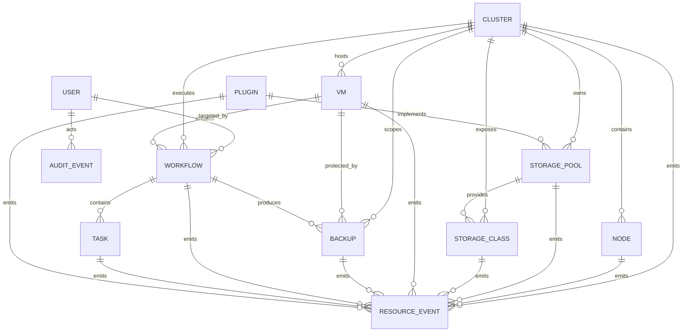

# P2-02 ER Model Design v0.9

> Status: Design Review
> Version: v0.9
> Depends on:
> - FROZEN-P1-01-DOMAIN-MODEL-v1.0
> - FROZEN-P2-01-DATA-ARCHITECTURE-v1.0
> Scope: CPP logical entity relationship model

---

## 1. Purpose

This document defines the logical ER model for CPP V2.0.

It translates the frozen resource model into entity relationships, cardinality, ownership, lifecycle references and deletion rules.

It does not define final SQL DDL. Physical tables, indexes, constraints and migrations are defined in P2-03 and P2-04.

---

## 2. Core Entities

CPP V2.0 contains the following primary entities:

```text
Cluster
Node
StoragePool
StorageClass
VM
Backup
Workflow
Task
Plugin
User
AuditEvent
ResourceEvent
```

All resource entities inherit the common Resource contract:

```text
metadata
spec
status
generation
resource_version
created_at
updated_at
deleted_at
```

---

## 3. High-Level ER Diagram



---

## 4. Cluster Relationships

Cluster is the top-level infrastructure aggregate.

```text
Cluster 1 -> N Node
Cluster 1 -> N StoragePool
Cluster 1 -> N StorageClass
Cluster 1 -> N VM
Cluster 1 -> N Backup
Cluster 1 -> N Workflow
Cluster 1 -> N ResourceEvent
```

Rules:

```text
1. Node must belong to exactly one Cluster.
2. StoragePool must belong to exactly one Cluster.
3. StorageClass must belong to exactly one Cluster.
4. VM must belong to exactly one Cluster.
5. Backup must belong to exactly one Cluster.
6. Workflow may belong to one Cluster or be platform-scoped.
7. Cluster deletion is blocked while active dependent resources exist.
```

---

## 5. Node Relationships

```text
Node N -> 1 Cluster
Node 1 -> N VM placement references
Node 1 -> N ResourceEvent
```

Rules:

```text
1. Node is cluster-scoped.
2. VM placement is a status reference, not ownership.
3. Node deletion is blocked while running VMs are observed on the node.
4. Historical events remain after Node soft deletion.
```

---

## 6. Storage Relationships

```text
StoragePool N -> 1 Cluster
StoragePool 1 -> N StorageClass
StoragePool N -> 0..1 Plugin
StorageClass N -> 1 Cluster
StorageClass N -> 1 StoragePool
```

Rules:

```text
1. StorageClass is an independent aggregate root.
2. StorageClass must reference exactly one StoragePool.
3. StoragePool deletion is blocked while active StorageClasses reference it.
4. Plugin reference is optional for built-in providers.
5. StorageClass deletion is blocked when active dependent VM disk references exist, unless an explicit destructive workflow is approved.
```

---

## 7. VM Relationships

```text
VM N -> 1 Cluster
VM 1 -> N Backup
VM 1 -> N Workflow
VM 1 -> N ResourceEvent
VM N -> 0..1 Node observed placement
VM N -> N StorageClass logical disk usage
```

Rules:

```text
1. VM is uniquely identified by CPP id; cluster_id + namespace + name must also be unique among non-deleted records.
2. Node placement belongs to VM.status and does not create ownership.
3. VM-to-StorageClass relationship is logical and may be represented through VM disk metadata rather than a mandatory join table in V2.0.
4. VM deletion does not delete Backup records.
5. VM destructive operations must be represented by Workflow.
```

---

## 8. Backup Relationships

```text
Backup N -> 1 Cluster
Backup N -> 0..1 VM
Backup N -> 0..1 Workflow producer
Backup 1 -> N ResourceEvent
```

Rules:

```text
1. Backup supports cluster, namespace, VM, PVC and etcd scopes.
2. target_kind + target_id define the optional protected resource.
3. Backup must survive deletion of the target resource for restore and audit purposes.
4. Producer Workflow may be null for externally discovered backups.
5. Backup hard deletion is governed by retention or explicit purge workflow.
```

---

## 9. Workflow and Task Relationships

```text
Workflow N -> 0..1 Cluster
Workflow N -> 1 User creator
Workflow 1 -> N Task
Workflow N -> 0..1 target resource
Task N -> 0..1 Workflow
```

Rules:

```text
1. Workflow may be platform-scoped.
2. Workflow target uses polymorphic target_kind + target_id.
3. Task may exist without Workflow for legacy direct execution.
4. Workflow deletion does not cascade-delete Tasks or execution history.
5. Workflow and Task records are retained for audit and diagnosis.
6. Task ordering within Workflow must be explicit through sequence_number.
```

---

## 10. Plugin Relationships

```text
Plugin 1 -> N StoragePool
Plugin 1 -> N ResourceEvent
```

Rules:

```text
1. Plugin may provide multiple capabilities.
2. Disabling a Plugin is blocked when active resources depend on it, unless force mode is explicitly approved.
3. Plugin deletion does not delete resources created by that Plugin.
4. Resource references to Plugin use stable plugin id and version metadata.
```

---

## 11. User Relationships

```text
User 1 -> N Workflow
User 1 -> N AuditEvent
```

Rules:

```text
1. User deletion is soft deletion or disablement.
2. Historical Workflow and AuditEvent records keep actor identity snapshots.
3. Foreign keys to User should be nullable or use restricted deletion to preserve history.
```

---

## 12. AuditEvent Entity

AuditEvent is append-only and not a normal mutable Resource.

Logical fields:

```yaml
AuditEvent:
  id: UUIDv7
  actor_id: string|null
  actor_name: string
  action: string
  target_kind: string|null
  target_id: string|null
  workflow_id: string|null
  result: success | failure | denied
  request_id: string|null
  details: object
  created_at: datetime
```

Rules:

```text
1. AuditEvent cannot be updated in place.
2. AuditEvent is not soft-deleted by resource deletion.
3. actor_name is snapshotted to preserve history if User changes.
4. target references are logical and may point to soft-deleted resources.
```

---

## 13. ResourceEvent Entity

ResourceEvent records lifecycle and state transitions.

Logical fields:

```yaml
ResourceEvent:
  id: UUIDv7
  resource_kind: string
  resource_id: string
  event_type: string
  source: string
  reason: string|null
  message: string|null
  generation: integer|null
  resource_version: string|null
  payload: object|null
  created_at: datetime
```

Rules:

```text
1. ResourceEvent is append-only.
2. ResourceEvent may refer to soft-deleted resources.
3. ResourceEvent is the source for WebSocket, monitoring and lifecycle history.
4. High-volume status samples belong in metrics, not ResourceEvent.
```

---

## 14. Polymorphic References

CPP uses logical polymorphic references where a record may target different resource kinds.

Examples:

```text
Workflow.target_kind + Workflow.target_id
Backup.target_kind + Backup.target_id
AuditEvent.target_kind + AuditEvent.target_id
ResourceEvent.resource_kind + ResourceEvent.resource_id
```

Rules:

```text
1. These references cannot rely only on database foreign keys.
2. Repository and service layers must validate target existence and allowed kinds.
3. References remain valid for soft-deleted targets.
4. Public APIs must expose both kind and id.
```

---

## 15. Soft Deletion and Cascade Rules

Default behavior:

```text
Resources -> soft delete
Workflow/Task -> retained
AuditEvent/ResourceEvent -> append-only retained
```

Cascade policy:

```text
1. No automatic destructive cascade across aggregate roots.
2. Cluster deletion requires preflight and explicit workflow.
3. StoragePool deletion is restricted by active StorageClass references.
4. VM deletion does not delete backups, tasks, workflows or events.
5. User disablement does not remove historical ownership or audit records.
```

---

## 16. Uniqueness Rules

Candidate logical uniqueness constraints:

```text
Cluster.name unique among non-deleted records
Node(cluster_id, hostname) unique among non-deleted records
StoragePool(cluster_id, name) unique among non-deleted records
StorageClass(cluster_id, name) unique among non-deleted records
VM(cluster_id, namespace, name) unique among non-deleted records
Plugin(name, version) unique among non-deleted records
User.username unique among non-deleted records
```

Workflow, Task, Backup, AuditEvent and ResourceEvent rely primarily on globally unique IDs.

---

## 17. Ownership Matrix

| Entity | Aggregate Root | Parent Scope | Deletion Behavior |
|---|---|---|---|
| Cluster | Yes | Platform | Restricted workflow |
| Node | Yes | Cluster | Restricted/soft delete |
| StoragePool | Yes | Cluster | Restricted/soft delete |
| StorageClass | Yes | Cluster | Restricted/soft delete |
| VM | Yes | Cluster | Workflow/soft delete |
| Backup | Yes | Cluster | Retention/purge workflow |
| Workflow | Yes | Platform or Cluster | Retained |
| Task | Yes | Optional Workflow | Retained |
| Plugin | Yes | Platform | Restricted/soft delete |
| User | Yes | Platform | Disable/soft delete |
| AuditEvent | Append-only | Platform | Retained |
| ResourceEvent | Append-only | Resource | Retained |

---

## 18. Review Decisions

Freeze candidates:

```text
1. Core entity set is accepted.
2. StorageClass remains an independent aggregate root.
3. Task may exist without Workflow.
4. Workflow and event targets use kind + id polymorphic references.
5. No automatic destructive cascade across aggregate roots.
6. AuditEvent and ResourceEvent are append-only retained entities.
7. Backup survives target resource deletion.
8. Cluster deletion requires explicit preflight workflow.
```

---

## 19. Deferred To P2-03/P2-04

```text
SQL column types
JSON versus normalized child tables
Index definitions
Foreign key DDL
Partial unique indexes
Alembic revisions
SQLite/PostgreSQL compatibility implementation
Retention jobs
```
