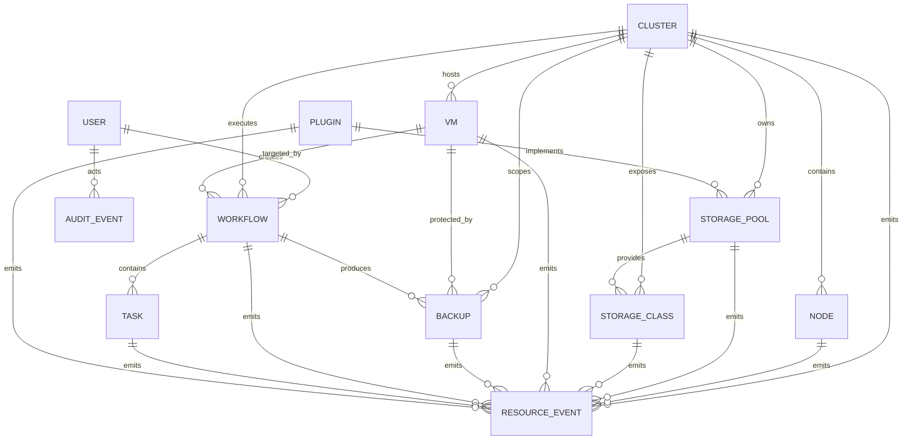

# FROZEN-P2-02 ER Model v1.0

> Status: FROZEN
> Version: v1.0
> Depends on:
> - FROZEN-P1-01-DOMAIN-MODEL-v1.0
> - FROZEN-P2-01-DATA-ARCHITECTURE-v1.0
> Scope: CPP logical entity relationship model
> Rule: Any incompatible change to entity identity, aggregate ownership, cardinality, deletion behavior, or event separation must create a new design version and pass review again.

---

## 1. Purpose

This frozen specification defines the logical ER model for CPP V2.0.

It translates the frozen resource model into entity relationships, ownership, lifecycle references and deletion rules. Final SQL DDL, indexes and migrations are defined in P2-03 and P2-04.

---

## 2. Frozen Entities

```text
Cluster
Node
StoragePool
StorageClass
VM
Backup
Workflow
Task
Plugin
User
AuditEvent
ResourceEvent
```

All resource entities inherit:

```text
metadata
spec
status
generation
resource_version
created_at
updated_at
deleted_at
```

---

## 3. Frozen ER Diagram



---

## 4. Cluster Aggregate

```text
Cluster 1 -> N Node
Cluster 1 -> N StoragePool
Cluster 1 -> N StorageClass
Cluster 1 -> N VM
Cluster 1 -> N Backup
Cluster 1 -> N Workflow
Cluster 1 -> N ResourceEvent
```

Rules:

```text
Node, StoragePool, StorageClass, VM and Backup belong to exactly one Cluster.
Workflow may be cluster-scoped or platform-scoped.
Cluster deletion is blocked while active dependent resources exist.
Cluster deletion requires an explicit preflight and destructive Workflow.
```

---

## 5. Node Aggregate

```text
Node N -> 1 Cluster
Node 1 -> N VM observed placements
Node 1 -> N ResourceEvent
```

Rules:

```text
Node is cluster-scoped.
VM placement is status data, not ownership.
Node deletion is blocked while running VMs are observed on the node.
Historical events survive Node soft deletion.
```

---

## 6. Storage Aggregates

```text
StoragePool N -> 1 Cluster
StoragePool 1 -> N StorageClass
StoragePool N -> 0..1 Plugin
StorageClass N -> 1 Cluster
StorageClass N -> 1 StoragePool
```

Rules:

```text
StorageClass is an independent aggregate root.
StorageClass must reference exactly one StoragePool.
StoragePool deletion is blocked while active StorageClasses reference it.
Plugin reference is optional for built-in providers.
StorageClass deletion is blocked when active VM disk references exist unless an approved destructive Workflow is used.
```

---

## 7. VM Aggregate

```text
VM N -> 1 Cluster
VM 1 -> N Backup
VM 1 -> N Workflow
VM 1 -> N ResourceEvent
VM N -> 0..1 Node observed placement
VM N -> N StorageClass logical disk usage
```

Rules:

```text
cluster_id + namespace + name is unique among non-deleted VMs.
Node placement belongs to VM.status.
VM-to-StorageClass relation may be represented through disk metadata in V2.0.
VM deletion does not delete Backup, Workflow, Task or Event history.
VM destructive operations must be Workflow operations.
```

---

## 8. Backup Aggregate

```text
Backup N -> 1 Cluster
Backup N -> 0..1 target resource
Backup N -> 0..1 producer Workflow
Backup 1 -> N ResourceEvent
```

Rules:

```text
Backup supports cluster, namespace, VM, PVC and etcd scopes.
target_kind + target_id identify the protected resource.
Backup survives target deletion.
Producer Workflow may be null for externally discovered backups.
Hard deletion is controlled by retention or an explicit purge Workflow.
```

---

## 9. Workflow and Task Aggregates

```text
Workflow N -> 0..1 Cluster
Workflow N -> 1 User creator
Workflow 1 -> N Task
Workflow N -> 0..1 target resource
Task N -> 0..1 Workflow
```

Rules:

```text
Workflow may be platform-scoped.
Workflow target uses target_kind + target_id.
Task may exist without Workflow for legacy direct execution.
Workflow deletion does not cascade-delete Tasks or history.
Task ordering uses sequence_number.
Workflow and Task records are retained for audit and diagnosis.
```

---

## 10. Plugin Aggregate

```text
Plugin 1 -> N StoragePool
Plugin 1 -> N ResourceEvent
```

Rules:

```text
Plugin may provide multiple capabilities.
Plugin disablement is blocked while active resources depend on it unless explicitly forced.
Plugin deletion does not delete resources created by it.
References use stable plugin id and version metadata.
```

---

## 11. User Aggregate

```text
User 1 -> N Workflow
User 1 -> N AuditEvent
```

Rules:

```text
User removal uses disablement or soft deletion.
Historical Workflow and AuditEvent records keep actor identity snapshots.
User references must preserve history.
```

---

## 12. AuditEvent

AuditEvent is append-only and not a normal mutable Resource.

```yaml
AuditEvent:
  id: UUIDv7
  actor_id: string|null
  actor_name: string
  action: string
  target_kind: string|null
  target_id: string|null
  workflow_id: string|null
  result: success | failure | denied
  request_id: string|null
  details: object
  created_at: datetime
```

Rules:

```text
AuditEvent cannot be updated in place.
AuditEvent is retained independently of resource deletion.
actor_name is snapshotted.
target references may point to soft-deleted resources.
```

---

## 13. ResourceEvent

```yaml
ResourceEvent:
  id: UUIDv7
  resource_kind: string
  resource_id: string
  event_type: string
  source: string
  reason: string|null
  message: string|null
  generation: integer|null
  resource_version: string|null
  payload: object|null
  created_at: datetime
```

Rules:

```text
ResourceEvent is append-only.
ResourceEvent may refer to soft-deleted resources.
It feeds lifecycle history, WebSocket and monitoring integrations.
High-frequency samples belong in metrics, not ResourceEvent.
```

---

## 14. Polymorphic References

Frozen polymorphic references:

```text
Workflow.target_kind + Workflow.target_id
Backup.target_kind + Backup.target_id
AuditEvent.target_kind + AuditEvent.target_id
ResourceEvent.resource_kind + ResourceEvent.resource_id
```

Rules:

```text
Repository and service layers validate target existence and allowed kinds.
References remain valid for soft-deleted targets.
Public APIs expose both kind and id.
Database foreign keys alone are not sufficient for these references.
```

---

## 15. Deletion and Cascade Policy

```text
Resources -> soft delete
Workflow/Task -> retained
AuditEvent/ResourceEvent -> append-only retained
```

No automatic destructive cascade is allowed across aggregate roots.

```text
Cluster deletion requires preflight Workflow.
StoragePool deletion is restricted by StorageClass references.
VM deletion does not delete backups or history.
User disablement does not remove historical actor references.
```

---

## 16. Frozen Uniqueness Rules

```text
Cluster.name unique among non-deleted records
Node(cluster_id, hostname) unique among non-deleted records
StoragePool(cluster_id, name) unique among non-deleted records
StorageClass(cluster_id, name) unique among non-deleted records
VM(cluster_id, namespace, name) unique among non-deleted records
Plugin(name, version) unique among non-deleted records
User.username unique among non-deleted records
```

Workflow, Task, Backup, AuditEvent and ResourceEvent use globally unique IDs.

---

## 17. Ownership Matrix

| Entity | Aggregate Root | Parent Scope | Deletion Behavior |
|---|---|---|---|
| Cluster | Yes | Platform | Restricted Workflow |
| Node | Yes | Cluster | Restricted/soft delete |
| StoragePool | Yes | Cluster | Restricted/soft delete |
| StorageClass | Yes | Cluster | Restricted/soft delete |
| VM | Yes | Cluster | Workflow/soft delete |
| Backup | Yes | Cluster | Retention/purge Workflow |
| Workflow | Yes | Platform or Cluster | Retained |
| Task | Yes | Optional Workflow | Retained |
| Plugin | Yes | Platform | Restricted/soft delete |
| User | Yes | Platform | Disable/soft delete |
| AuditEvent | Append-only | Platform | Retained |
| ResourceEvent | Append-only | Resource | Retained |

---

## 18. Frozen Decisions

```text
1. Core entity set is frozen.
2. StorageClass is an independent aggregate root.
3. Task may exist without Workflow.
4. Workflow, Backup and events use kind + id polymorphic references.
5. No automatic destructive cascade across aggregate roots.
6. AuditEvent and ResourceEvent are append-only retained entities.
7. Backup survives target deletion.
8. Cluster deletion requires explicit preflight Workflow.
```

---

## 19. Deferred

```text
SQL types and DDL -> P2-03
Indexes and constraints -> P2-03
Alembic migration strategy -> P2-04
Retention implementation -> P2-04/P8
Repository implementation -> implementation phase
```
